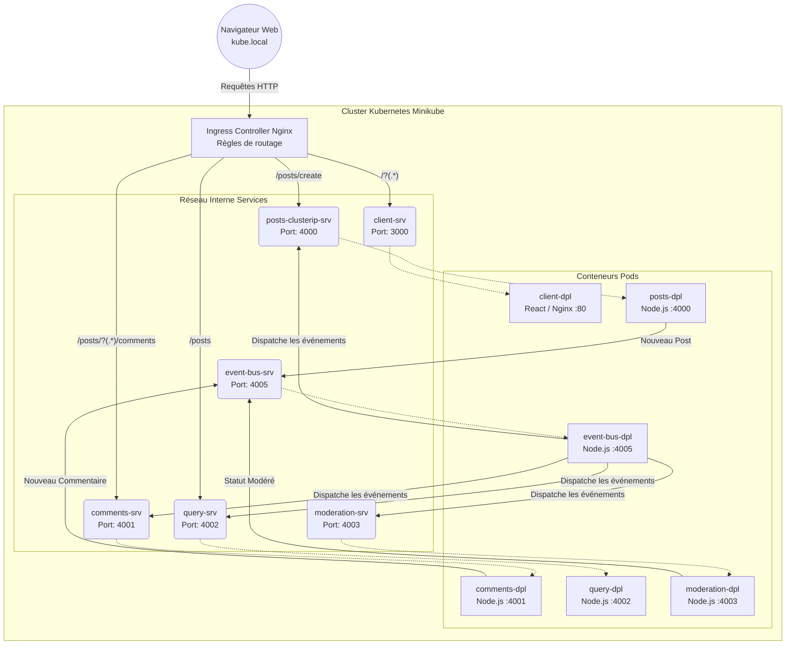

```mermaid
graph TD

    User((Navigateur Web<br/>kube.local)):::external

    subgraph Cluster Kubernetes Minikube
        
        Ingress[Ingress Controller Nginx<br/>Règles de routage]:::ingress
        
        subgraph Réseau Interne Services
            ClientSrv(client-srv<br/>Port: 3000):::service
            PostsSrv(posts-clusterip-srv<br/>Port: 4000):::service
            CommentsSrv(comments-srv<br/>Port: 4001):::service
            QuerySrv(query-srv<br/>Port: 4002):::service
            ModSrv(moderation-srv<br/>Port: 4003):::service
            EventSrv(event-bus-srv<br/>Port: 4005):::service
        end

        subgraph Conteneurs Pods
            ClientPod[client-dpl<br/>React / Nginx :80]:::pod
            PostsPod[posts-dpl<br/>Node.js :4000]:::pod
            CommentsPod[comments-dpl<br/>Node.js :4001]:::pod
            QueryPod[query-dpl<br/>Node.js :4002]:::pod
            ModPod[moderation-dpl<br/>Node.js :4003]:::pod
            EventPod[event-bus-dpl<br/>Node.js :4005]:::pod
        end
    end


    User -- "Requêtes HTTP" --> Ingress

    Ingress -- " /?(.*) " --> ClientSrv
    Ingress -- " /posts/create " --> PostsSrv
    Ingress -- " /posts/?(.*)/comments " --> CommentsSrv
    Ingress -- " /posts " --> QuerySrv

    ClientSrv -.-> ClientPod
    PostsSrv -.-> PostsPod
    CommentsSrv -.-> CommentsPod
    %% 4. Communication asynchrone (Event Bus)
    QuerySrv -.-> QueryPod
    ModSrv -.-> ModPod
    EventSrv -.-> EventPod

    PostsPod -- "Nouveau Post" --> EventSrv
    CommentsPod -- "Nouveau Commentaire" --> EventSrv
    ModPod -- "Statut Modéré" --> EventSrv
    
    EventPod -- "Dispatche les événements" --> PostsSrv
    EventPod -- "Dispatche les événements" --> CommentsSrv
    EventPod -- "Dispatche les événements" --> QuerySrv
    EventPod -- "Dispatche les événements" --> ModSrv
```